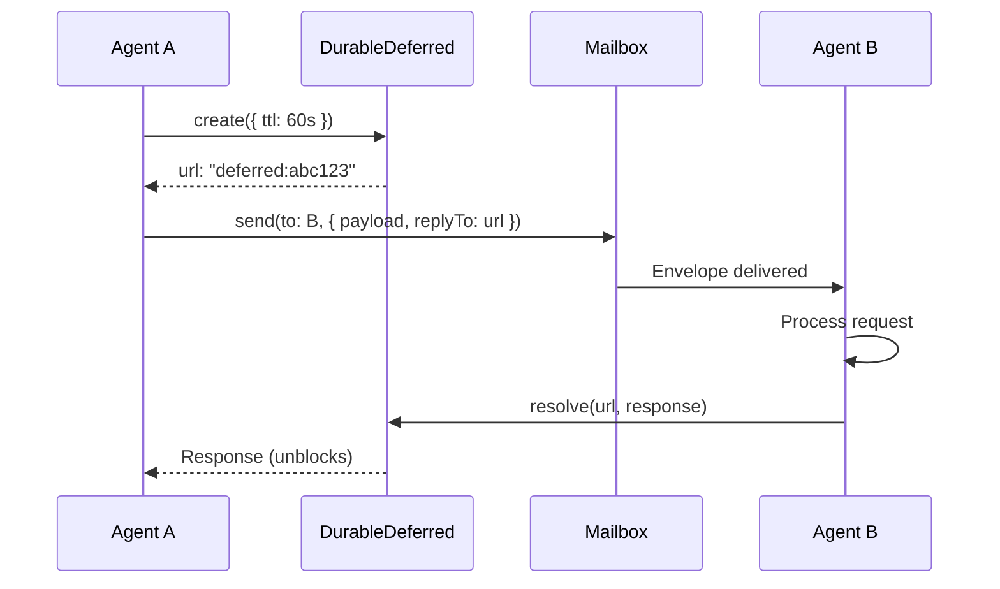

# Durable Streams Primitives

The foundational building blocks of Swarm Mail. Inspired by Kyle Matthews' [Durable Streams protocol](https://x.com/kylemathews/status/1999896667030700098).

---

## DurableCursor - Positioned Event Stream Consumption

**Purpose:** Read events from a stream with resumable position tracking.

**Key Concept:** Event streams are append-only logs. Cursors track the "last read position" (sequence number) and checkpoint it to the database. If an agent crashes, it resumes from the last committed position.

### API

```typescript
const cursor =
  yield *
  cursorService.create({
    stream: "projects/foo/events", // Stream identifier
    checkpoint: "agents/bar/position", // Unique checkpoint name
    batchSize: 100, // Read 100 events at a time
  });

// Consume events as async iterable
for await (const msg of cursor.consume()) {
  yield * handleMessage(msg.value);
  yield * msg.commit(); // Checkpoint this position
}
```

### Implementation Details

- **Schema:** `cursors` table with `(stream, checkpoint)` UNIQUE constraint
- **Batching:** Reads events in batches (default 100) for efficiency
- **Commit:** Updates `position` in database + in-memory `Ref`
- **Resumability:** On restart, loads last committed position from DB

### Database Schema

```sql
CREATE TABLE cursors (
  id SERIAL PRIMARY KEY,
  stream TEXT NOT NULL,         -- Stream name (e.g., "projects/foo/events")
  checkpoint TEXT NOT NULL,     -- Checkpoint name (e.g., "agents/bar/position")
  position BIGINT NOT NULL,     -- Last committed sequence number
  updated_at BIGINT NOT NULL,
  UNIQUE(stream, checkpoint)
);
CREATE INDEX idx_cursors_checkpoint ON cursors(checkpoint);
```

### Use Cases

- Inbox consumption - agent reads messages from stream
- Event processing - workers consume tasks from event log
- Exactly-once semantics - commit after processing, skip on replay

### Example: Resumable Event Processing

```typescript
import { DurableCursor } from "swarm-mail/streams/effect/cursor";
import { DurableCursorLive } from "swarm-mail/streams/effect/layers";

const program = Effect.gen(function* () {
  const cursorService = yield* DurableCursor;

  const cursor = yield* cursorService.create({
    stream: "projects/foo/events",
    checkpoint: "workers/event-processor",
    batchSize: 50,
  });

  console.log("Starting from position:", yield* cursor.getPosition());

  for await (const msg of cursor.consume()) {
    console.log("Processing event:", msg.value);

    // Simulate processing
    yield* Effect.sleep("100 millis");

    // Checkpoint position
    yield* msg.commit();
  }
});

Effect.runPromise(program.pipe(Effect.provide(DurableCursorLive)));

// If this crashes, next run starts from last committed position
```

### Event Stream Structure

```
events table (append-only log):

┌────┬──────────┬──────────────┬───────────────┬─────────────────────────────┐
│ id │ sequence │     type     │   timestamp   │           payload           │
├────┼──────────┼──────────────┼───────────────┼─────────────────────────────┤
│  1 │    1     │ agent_reg... │ 1704000000000 │ { agent: "AgentA", ... }    │
│  2 │    2     │ message_sent │ 1704000001000 │ { from: "A", to: ["B"] }    │
│  3 │    3     │ file_reserv. │ 1704000002000 │ { agent: "A", paths: [...]} │
│  4 │    4     │ message_read │ 1704000003000 │ { message_id: 2, agent: "B"}│
│  5 │    5     │ file_releas. │ 1704000004000 │ { agent: "A", paths: [...]} │
└────┴──────────┴──────────────┴───────────────┴─────────────────────────────┘
                                     ▲
                                     │
                                     │  DurableCursor reads from here
                                     │  Checkpoints last sequence number
                                     │
                             ┌───────────────────┐
                             │  cursors table    │
                             ├───────────────────┤
                             │ checkpoint: "..."  │
                             │ position: 4       │ ← Resume from seq=5
                             └───────────────────┘
```

---

## DurableDeferred - Distributed Promises

**Purpose:** Create a "distributed promise" that can be resolved from anywhere (think of it as a URL-addressable future value).

**Key Concept:** You create a deferred with a unique URL, pass that URL to another agent, and block waiting for the response. The other agent resolves the deferred by URL, unblocking you.

### API

```typescript
// Agent A: Create deferred and send request
const deferred =
  yield *
  deferredService.create<Response>({
    ttlSeconds: 60,
  });

yield *
  mailbox.send("agent-b", {
    payload: { task: "getData" },
    replyTo: deferred.url, // URL like "deferred:abc123"
  });

const response = yield * deferred.value; // Blocks until resolved or timeout

// Agent B: Resolve deferred
yield * deferredService.resolve(envelope.replyTo, { data: "result" });
```

### Implementation Details

- **Schema:** `deferred` table with `url UNIQUE`, `resolved BOOLEAN`, `value JSONB`
- **In-memory registry:** `Map<url, Effect.Deferred>` for instant resolution (no polling)
- **Fallback polling:** If in-memory deferred missing (agent restart), polls database every 100ms
- **TTL expiry:** Auto-cleanup of expired deferreds
- **Errors:** `TimeoutError` if TTL expires, `NotFoundError` if URL doesn't exist

### Database Schema

```sql
CREATE TABLE deferred (
  id SERIAL PRIMARY KEY,
  url TEXT NOT NULL UNIQUE,     -- Unique identifier (e.g., "deferred:abc123")
  resolved BOOLEAN NOT NULL DEFAULT FALSE,
  value JSONB,                  -- Resolution value
  error TEXT,                   -- Rejection error message
  expires_at BIGINT NOT NULL,   -- TTL expiry timestamp
  created_at BIGINT NOT NULL
);
CREATE INDEX idx_deferred_url ON deferred(url);
CREATE INDEX idx_deferred_expires ON deferred(expires_at);
```

### Use Cases

- Request/response - ask pattern (see below)
- RPC over streams - synchronous-style calls between agents
- Coordination - agent waits for signal from another agent

---

## DurableLock - Distributed Mutual Exclusion

**Purpose:** Acquire exclusive locks on resources using Compare-And-Swap (CAS) pattern.

**Key Concept:** CAS (seq=0) pattern - try to INSERT (no lock exists) or UPDATE (lock expired or we already hold it). Uses exponential backoff for retries on contention.

### API

```typescript
// Acquire lock with retry
const lock =
  yield *
  lockService.acquire("my-resource", {
    ttlSeconds: 30,
    maxRetries: 10,
  });

try {
  // Critical section - only one agent here at a time
  yield * doWork();
} finally {
  yield * lock.release();
}

// Or use helper
yield * lockService.withLock("my-resource", Effect.succeed(42));
```

### Implementation Details

- **Schema:** `locks` table with `resource UNIQUE`, `holder TEXT`, `seq INTEGER`
- **CAS logic:**
  1. Try `INSERT` (no lock exists) → success
  2. If INSERT fails, try `UPDATE WHERE expires_at < now OR holder = me` → success if stale/reentrant
  3. If UPDATE returns 0 rows → contention, retry with backoff
- **Exponential backoff:** 50ms base delay, doubles each retry (50ms, 100ms, 200ms...)
- **Auto-expiry:** TTL stored in `expires_at`, stale locks can be claimed
- **Errors:** `LockTimeout` if max retries exceeded, `LockNotHeld` if release by wrong holder

### Database Schema

```sql
CREATE TABLE locks (
  id SERIAL PRIMARY KEY,
  resource TEXT NOT NULL UNIQUE, -- Resource being locked
  holder TEXT NOT NULL,           -- Agent holding lock
  seq INTEGER NOT NULL,           -- CAS sequence number
  acquired_at BIGINT NOT NULL,
  expires_at BIGINT NOT NULL,
  UNIQUE(resource)
);
```

### Use Cases

- File reservations - prevent edit conflicts (Swarm Mail uses this)
- Critical sections - only one agent modifying shared state
- Leader election - first to acquire lock becomes leader

### File Reservation Protocol

```
┌──────────┐                                          ┌──────────┐
│ Agent A  │                                          │ Agent B  │
└────┬─────┘                                          └────┬─────┘
     │                                                     │
     │ 1. Reserve src/auth.ts (exclusive)                 │
     ├────────────────────────────────────────────┐       │
     │                                            │       │
     │ 2. DurableLock.acquire("src/auth.ts")     │       │
     │    → Granted (no conflicts)                │       │
     │                                            │       │
     │ 3. Edit src/auth.ts                        │       │
     │                                            │       │ 4. Reserve src/auth.ts
     │                                            │       ├──────────────────────┐
     │                                            │       │                      │
     │                                            │       │ 5. Lock contention   │
     │                                            │       │    → Warned (Agent A │
     │                                            │       │       holds lock)    │
     │                                            │       │                      │
     │ 6. Release src/auth.ts                     │       │                      │
     ├────────────────────────────────────────────┤       │                      │
     │                                            │       │                      │
     │ 7. DurableLock.release()                   │       │ 8. Retry acquire     │
     │                                            │       │    → Granted         │
     │                                            │       │                      │
```

### File Reservation Protocol (CAS Lock)

```
┌──────────┐                                          ┌──────────┐
│ Agent A  │                                          │ Agent B  │
└────┬─────┘                                          └────┬─────┘
     │                                                     │
     │ 1. Reserve src/auth.ts                             │
     ├─────────────────────────────┐                      │
     │                             │                      │
     │ 2. DurableLock.acquire()    │                      │
     │    INSERT INTO locks        │                      │
     │    VALUES ('src/auth.ts',   │                      │
     │            'AgentA',         │                      │
     │            seq=0)            │                      │
     │    → SUCCESS                 │                      │
     │                             │                      │
     │ 3. Edit src/auth.ts         │                      │
     │                             │                      │
     │                             │    4. Reserve src/auth.ts
     │                             │    ├──────────────────────┐
     │                             │    │                      │
     │                             │    │ 5. TRY INSERT        │
     │                             │    │    → CONFLICT        │
     │                             │    │                      │
     │                             │    │ 6. TRY UPDATE        │
     │                             │    │    WHERE expires_at  │
     │                             │    │    < now OR          │
     │                             │    │    holder='AgentB'   │
     │                             │    │    → 0 rows          │
     │                             │    │                      │
     │                             │    │ 7. Retry with        │
     │                             │    │    exponential       │
     │                             │    │    backoff...        │
     │                             │    │                      │
     │ 8. Release lock             │    │                      │
     ├─────────────────────────────┤    │                      │
     │                             │    │                      │
     │ 9. DELETE FROM locks        │    │ 10. Retry succeeds   │
     │    WHERE resource=...       │    │     UPDATE (0 rows   │
     │    AND holder='AgentA'      │    │     before, now      │
     │                             │    │     lock is free)    │
     │                             │    │     → SUCCESS        │
     │                             │    │                      │
```

---

## DurableMailbox - Actor-Style Messaging

**Purpose:** Send/receive envelopes between agents using cursor-based positioned consumption.

**Key Concept:** Combines DurableCursor (positioned reading) + Envelope pattern (payload + metadata). Each agent has a named mailbox, messages are filtered by recipient during consumption.

### API

```typescript
const mailbox =
  yield *
  mailboxService.create({
    agent: "worker-1",
    projectKey: "proj-123",
  });

// Send message with optional reply channel
yield *
  mailbox.send("worker-2", {
    payload: { task: "process-data" },
    replyTo: "deferred:xyz", // For request/response
    threadId: "bd-123", // Conversation tracking
  });

// Receive messages (filters to only messages for this agent)
for await (const envelope of mailbox.receive()) {
  console.log(envelope.payload);
  if (envelope.replyTo) {
    yield * DurableDeferred.resolve(envelope.replyTo, result);
  }
  yield * envelope.commit(); // Checkpoint position
}
```

### Implementation Details

- **Cursor creation:** Creates `DurableCursor` with filter `types: ["message_sent"]`
- **Filtering:** `eventToEnvelope()` skips messages not addressed to this agent
- **Envelope structure:**
  ```typescript
  {
    payload: T,           // Your message data
    replyTo?: string,     // Deferred URL for response
    sender: string,       // From agent
    messageId: number,    // Message ID
    threadId?: string,    // Conversation grouping
    commit: () => Effect  // Checkpoint this message
  }
  ```
- **Storage:** Messages stored as `message_sent` events in event stream

### Database Schema

#### `messages` - Materialized Message View

```sql
CREATE TABLE messages (
  id SERIAL PRIMARY KEY,
  project_key TEXT NOT NULL,
  from_agent TEXT NOT NULL,
  subject TEXT NOT NULL,
  body TEXT NOT NULL,
  thread_id TEXT,
  importance TEXT DEFAULT 'normal',
  created_at BIGINT NOT NULL,
  read_by JSONB DEFAULT '[]',   -- Array of agent names who read it
  acked_by JSONB DEFAULT '[]'   -- Array of agent names who acked it
);
```

#### `message_recipients` - Message Routing

```sql
CREATE TABLE message_recipients (
  id SERIAL PRIMARY KEY,
  message_id INTEGER NOT NULL REFERENCES messages(id),
  agent_name TEXT NOT NULL,
  UNIQUE(message_id, agent_name)
);
CREATE INDEX idx_message_recipients_agent ON message_recipients(agent_name);
```

#### `reservations` - Active File Locks

```sql
CREATE TABLE reservations (
  id SERIAL PRIMARY KEY,
  project_key TEXT NOT NULL,
  agent_name TEXT NOT NULL,
  path_pattern TEXT NOT NULL,   -- File path or glob pattern
  exclusive BOOLEAN NOT NULL,
  reason TEXT,
  expires_at BIGINT NOT NULL
);
CREATE INDEX idx_reservations_agent ON reservations(agent_name);
CREATE INDEX idx_reservations_path ON reservations(path_pattern);
```

### Use Cases

- Agent inbox - receive tasks, status updates, blockers
- Broadcast - send message to multiple agents
- Request/response - combine with DurableDeferred (see ask pattern)

### Message Flow Between Agents

```
┌───────────┐                    ┌──────────────┐                    ┌───────────┐
│  Agent A  │                    │ Event Stream │                    │  Agent B  │
└─────┬─────┘                    └──────┬───────┘                    └─────┬─────┘
      │                                 │                                  │
      │ 1. Send message                 │                                  │
      ├────────────────────────────────>│                                  │
      │    { to: "agent-b",             │ 2. Append message_sent event     │
      │      payload: {...} }           │    (id=42, seq=100)              │
      │                                 │                                  │
      │                                 │ 3. Update message view           │
      │                                 │    INSERT INTO messages (...)    │
      │                                 │                                  │
      │                                 │                                  │
      │                                 │         4. Agent B consumes      │
      │                                 │<─────────────────────────────────┤
      │                                 │    DurableCursor.consume()       │
      │                                 │    afterSequence=99              │
      │                                 │                                  │
      │                                 │ 5. Return events                 │
      │                                 ├─────────────────────────────────>│
      │                                 │    [{ seq=100, type=msg_sent }]  │
      │                                 │                                  │
      │                                 │    6. Process message            │
      │                                 │<─────────────────────────────────┤
      │                                 │       msg.commit()               │
      │                                 │                                  │
      │                                 │ 7. Checkpoint position=100       │
      │                                 │<─────────────────────────────────┤
      │                                 │                                  │
```

---

## The Ask Pattern - Request/Response over Streams

**Purpose:** Synchronous-style RPC between agents using async streams.

### How It Works

```
┌─────────┐                                                  ┌─────────┐
│ Agent A │                                                  │ Agent B │
└────┬────┘                                                  └────┬────┘
     │                                                            │
     │ 1. Create deferred                                        │
     │    url = "deferred:abc123"                                │
     │                                                            │
     │ 2. Send message with replyTo=url                          │
     ├──────────────────────────────────────────────────────────>│
     │                                                            │
     │ 3. Block on deferred.value                                │ 4. Process request
     │    (waits...)                                             │
     │                                                            │
     │                                   5. Resolve deferred(url) │
     │<───────────────────────────────────────────────────────────┤
     │                                                            │
     │ 6. Unblocked, return response                             │
     │                                                            │
```

### Code Example

```typescript
// Agent A (caller)
const response =
  yield *
  ask<Request, Response>({
    mailbox: myMailbox,
    to: "worker-2",
    payload: { query: "getUserData", userId: 123 },
    ttlSeconds: 30,
  });

// Agent B (responder)
for await (const envelope of mailbox.receive()) {
  const result = processRequest(envelope.payload);
  if (envelope.replyTo) {
    yield * DurableDeferred.resolve(envelope.replyTo, result);
  }
  yield * envelope.commit();
}
```

### Why This Matters

- **Synchronous feel, async reality** - code looks like RPC, but it's event-driven
- **Resilient** - if responder crashes, caller gets timeout (not hung forever)
- **Auditable** - all request/response pairs in event log
- **Type-safe** - full TypeScript inference for request/response types

### Example: Request/Response with Ask Pattern

```typescript
import { ask, respond } from "swarm-mail/streams/effect/ask";
import { DurableAskLive } from "swarm-mail/streams/effect/layers";

// Agent A (requester)
const agentA = Effect.gen(function* () {
  const mailboxService = yield* DurableMailbox;
  const mailbox = yield* mailboxService.create({
    agent: "agent-a",
    projectKey: "proj",
  });

  console.log("Requesting user data...");

  const response = yield* ask<Request, Response>({
    mailbox,
    to: "agent-b",
    payload: { userId: 123 },
    ttlSeconds: 30,
  });

  console.log("Got response:", response);
});

// Agent B (responder)
const agentB = Effect.gen(function* () {
  const mailboxService = yield* DurableMailbox;
  const mailbox = yield* mailboxService.create({
    agent: "agent-b",
    projectKey: "proj",
  });

  console.log("Listening for requests...");

  for await (const envelope of mailbox.receive<Request>()) {
    console.log("Processing request:", envelope.payload);

    const result = { name: "John", id: envelope.payload.userId };

    yield* respond(envelope, result);
    yield* envelope.commit();
  }
});

// Run both agents in parallel
const program = Effect.all([agentA, agentB], { concurrency: "unbounded" });
Effect.runPromise(program.pipe(Effect.provide(DurableAskLive)));
```

### Ask Pattern Sequence Diagram



---

## Summary

Swarm Mail provides four foundational primitives:

1. **DurableCursor** - Resumable event stream consumption with checkpointing
2. **DurableDeferred** - Distributed promises for request/response
3. **DurableLock** - CAS-based mutual exclusion for file reservations
4. **DurableMailbox** - Actor-style messaging with positioned consumption

These compose into higher-level patterns like the **ask pattern** for RPC-style communication between agents.

All primitives are:

- ✅ **Event-sourced** - full audit trail
- ✅ **Resumable** - checkpoint positions survive crashes
- ✅ **Type-safe** - full TypeScript + Effect-TS inference
- ✅ **Local-first** - embedded PGLite, no network dependencies

See the [main documentation](/docs/packages/swarm-mail) for architecture overview and integration guides.
